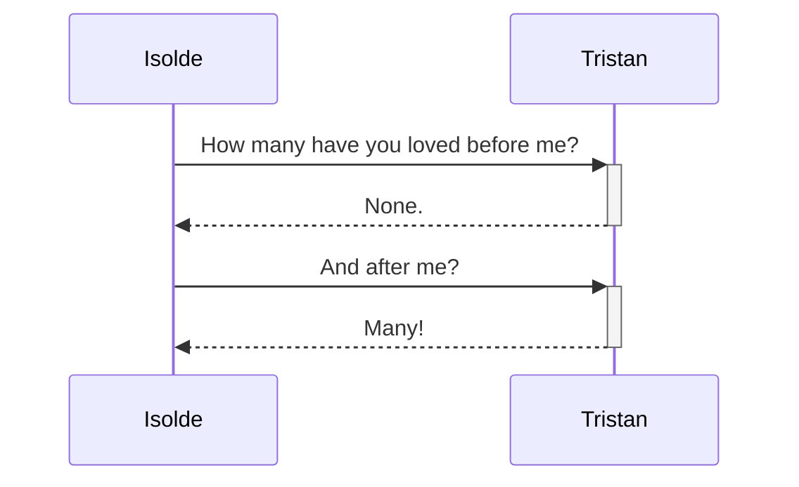

# To preview

- Launch VS Code Quick Open (Ctrl+P), paste the following command, and press enter.

  ext install bierner.markdown-mermaid

- Now hit Shift+Ctrl+V

# A lovers' dialogue

```mermaid
sequenceDiagram
    Isolde->>+Tristan: How many have you loved before me?
    Tristan-->>-Isolde: None.
    Isolde->>+Tristan: And after me?
    Tristan-->>-Isolde: Many!
```
